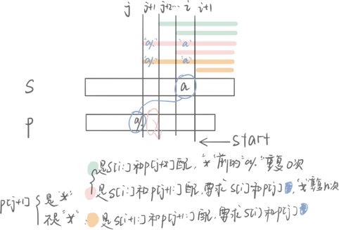

## 12.13 正则表达式匹配

给你一个字符串 `s` 和一个字符规律 `p`，请你来实现一个支持 `'.'` 和 `'*'` 的正则表达式匹配。

```
'.' 匹配任意单个字符
'*' 匹配零个或多个前面的那一个元素
```

所谓匹配，是要涵盖 **整个** 字符串 `s`的，而不是部分字符串。

**说明:**

- `s` 可能为空，且只包含从 `a-z` 的小写字母。
- `p` 可能为空，且只包含从 `a-z` 的小写字母，以及字符 `.` 和 `*`。

**示例 1:**

```
输入:
s = "aa"
p = ".*...a*"
输出: false
```

**示例 2:**

```
输入:
s = "aab"
p = "c*a*b"
输出: true
解释: 因为 '*' 表示零个或多个，这里 'c' 为 0 个, 'a' 被重复一次。因此可以匹配字符串 "aab"。
```

### 动态规划

$dp[i][j]$ 表示 $s[i:]$ 和 $p[j:]$ 能成功匹配，从尾部开始递归。

初始化使得 $dp[m][n]$ 为true，开始dp

状态转移过程为：

- 如果 $p[j+1]$ 为 $*$ 
  - $dp[i][j] = dp[i][j + 2]$：$*$ 不起作用，字母重复0次
  - $dp[i][j] = match\ \&\ dp[i + 1][j]$：$*$起作用，则如果$s[i+1:]$ 与 $p[j:]$ 可以匹配，那么 $dp[i][j]$ 一定可以匹配
    - 有可能是 $*$ 前的字符出现一次导致匹配
    - 有可能是 $*$ 前的字符在 $dp[i + 1][j]$ 的时候已经匹配，此时再加匹配一次
- 否则，$dp[i][j] = match\ \&\ dp[i + 1][j + 1]$：如果$s[i+1:]$ 与 $p[j+1:]$ 可以匹配，那么 $dp[i][j]$ 一定可以匹配

时间复杂度 $O(mn)$

```c++
bool isMatch(string s, string p) {
    int m = s.length(), n = p.length();
    vector<vector<bool>> dp (m + 1);
    for (int i = 0; i < m + 1; ++i) {
        dp[i].resize(n + 1);
    }
    dp[m][n] = true;
    for (int i = m; i >= 0; --i) {
        for (int j = n - 1; j >= 0; --j) {
            bool match = (i < m && (s[i] == p[j] || p[j] == '.'));
            if (j + 1 < n && p[j + 1] == '*') {
                dp[i][j] = dp[i][j + 2] || (match && dp[i + 1][j]);
            } else {
                dp[i][j] = match && dp[i + 1][j + 1];
            }
        }
    }
    return dp[0][0];
}
```

